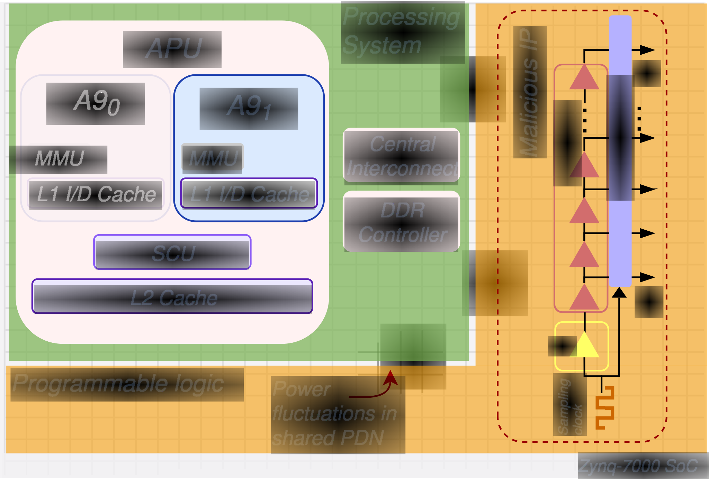

<p align="center">
  
</p>

<h1 align="center">SnoopyPower!</h1>

<p align="center">
  <em>Remote Power Attacks on Cache and Coherence Paths</em><br/>
  <em>OS version: PDN-based cache and coherence characterization on Zynq-7000 SoC-FPGAs running Linux.</em>
</p>

<p align="center">
  <a href="https://hal.science/hal-05593696v1"><strong>Paper (HAL)</strong></a> ·
  <a href="https://zenodo.org/records/19003752"><strong>Bare-metal artifacts (Zenodo)</strong></a> ·
  <a href="#overview">Overview</a> ·
  <a href="#attack-primitives">Attack Primitives</a> ·
  <a href="#quickstart">Quickstart</a> ·
  <a href="#architecture">Architecture</a> ·
  <a href="#patterns">Patterns</a> ·
  <a href="#analysis">Analysis</a> ·
  <a href="#repository-layout">Layout</a> ·
  <a href="#citation">Citation</a> ·
  <a href="#license">License</a>
</p>

---

## Overview

This repository is the **OS version** of the companion code for:

> **SnoopyPower! Remote Power Attacks on Cache and Coherence Paths**
> Eliott Quéré, Maria Méndez Real, Alessandro Palumbo, Thomas Rokicki, Lilian Bossuet, Rubén Salvador
> *HOST 2026, IEEE International Symposium on Hardware Oriented Security and Trust*, May 2026, Washington DC.

The paper shows that **power leakage from the shared Power Distribution Network (PDN)** of heterogeneous SoC-FPGAs can resolve CPU microarchitectural states, including cache-hierarchy levels (L1, L2, DRAM) and Snoop Control Unit (SCU) coherence paths, even when those states are deliberately timing-indistinguishable on Arm processors.

### What is in this repository (OS version)

This repository contains the **OS-adapted implementation** running on PynqLinux 3.0 (Ubuntu 22.04 based PYNQ image). It implements:

- **L1 / L2 / DRAM characterization** (paper Section III and Section VI-D): deterministic cache-state preparation and PDN trace collection from Linux userspace.
- **Self-load vs. peer-L1 snoop characterization** (paper Section V and Section VI-D): coherence-path discrimination between the two SCU resolution paths.
- The full statistical analysis pipeline (preprocessing, POI selection, LDA/QDA classification, publication figures).

The bare-metal implementation (Flush+Power AES T-table attack, SnoopyPower cross-core address discovery, and all bare-metal artifacts) is available on **[Zenodo](https://zenodo.org/records/19003752)**.

### How it works

The TDC sensor is embedded in the Zynq-7000 Programmable Logic (PL) and shares the PDN with the dual Arm Cortex-A9 cores. A single software-triggered memory load generates a short PDN signature captured by the TDC at 250 MSa/s (4 ns sampling period). These signatures are sufficient to classify the memory-service level with up to **98.7% accuracy** (LDA, 3-class L1/L2/DRAM) under OS noise, and to discriminate coherence paths (self vs. peer-L1 snoop) with **94.3% accuracy** (QDA) after retraining on OS traces.

This is an adaptation of the [SCAbox](https://emse-sas-lab.github.io/SCAbox/) framework to Linux, with custom drivers, bitstream, and userspace tooling for the PynqZ1 board. No kernel module, no bare-metal flash, no JTAG.

<p align="center">
  
</p>
<p align="center"><em>System architecture. The TDC sensor shares the Zynq-7000 PDN with the
Cortex-A9 cores, capturing voltage fluctuations induced by cache and memory
events through the FPGA fabric.</em></p>

### Key features

- **On-chip TDC power sensor**: 250 MSa/s (4 ns period), sub-nanosecond resolution via thermometer-coded delay line, no physical probe required
- **Deterministic cache-state control**: userspace eviction-based patterns for L1 hit, L2 hit, and DRAM miss, all funnelling into the same fenced assembly measurement window (DSB/ISB barriers for privileged, dependency chains for unprivileged)
- **OS-native execution**: runs entirely from Linux userspace (PynqLinux 3.0 / Ubuntu 22.04) via `/dev/mem` MMIO; no kernel module
- **Privileged and unprivileged probes**: both memory-barrier-based (paper Section III-B) and dependency-based (paper Section III-C) measurement windows
- **Strong dataset generation**: random target addresses and values from `/dev/urandom` via a 2 MiB anonymous `mmap()` arena, eliminating deterministic bias
- **FIFO-triggered measurement**: hardware FIFO synchronizes the TDC capture window with the memory access under test for cycle-accurate alignment
- **Auto-calibrating TDC**: per-channel delay-line tuning with polarity-aware sweep, plus a `SNOOPYPOWER_TDC_DELAY` env var to lock calibration across runs
- **Reproducible analysis pipeline**: Python scripts for HPF preprocessing (1 MHz high-pass), normality tests (Shapiro-Wilk, D'Agostino, Pearson chi-squared), KS-based POI selection with Bonferroni correction, LDA/QDA classification with cross-validation, and publication figures

---

<a id="attack-primitives"></a>
## Attack primitives (from the paper)

The paper introduces two new attack primitives. The bare-metal implementations and end-to-end attack demonstrations are available on [Zenodo](https://zenodo.org/records/19003752). Below is a summary of each primitive.

### Flush+Power (Section IV)

A profiled, timer-free, same-core cache attack. The attacker shares a memory page with the victim and operates in three steps:

1. **Flush**: evict the monitored cache line from L1.
2. **Victim activity**: the victim executes normally, potentially bringing lines into L1/L2.
3. **Power probe**: a fenced `LDRB` to the monitored address triggers a TDC capture. A pre-trained LDA classifier determines whether the load was served from L1 (victim touched it) or L2/DRAM (victim did not).

Flush+Power recovers per-byte first-round AES T-table accesses from a single PDN trace (86% balanced accuracy, line-level resolution among 32 cache lines). A line-level sweep (S=8) with R=2 achieves clean single-trace identification.

### SnoopyPower (Section V)

A profiled, timer-free, cross-core coherence attack. Two tenants run on separate Cortex-A9 cores with a shared page:

1. **Victim activity**: the victim writes to a shared line, placing it in Modified state in its private L1.
2. **Coherence probe**: the attacker loads the same address. The SCU resolves this via either a peer-L1 snoop (victim holds Modified copy) or the self path (local L1 / shared L2). These paths differ by less than one cycle in latency and are timing-indistinguishable on Arm, but they produce distinct PDN signatures.

SnoopyPower identifies the victim-written line among 100 unseen candidate addresses with r=5 probes per line in under 2 minutes (QDA, 99.9% confidence on the correct line).

> On Arm, the SCU collapses peer-L1 and self-load latencies by design. Power, not timing, is the decisive channel.

---

## Built upon SCAbox

SnoopyPower is built upon [SCAbox](https://emse-sas-lab.github.io/SCAbox/), the open framework for FPGA-based remote side-channel analysis developed at Ecole des Mines de Saint-Etienne (EMSE). The TDC bank and FIFO IP cores under [`hw/ip_repo/`](hw/ip_repo/) preserve their original SCAbox vendor namespace (`emse.sas:sca:tdc_bank`, `emse.sas:sca:fifo_and_ctrl`) inside their `component.xml` so the Vivado IP catalog still recognises them.

This repository is an OS adaptation of SCAbox to PynqLinux 3.0, providing custom drivers, bitstream, and the full userspace measurement and analysis pipeline.

If you use SnoopyPower in academic work, please cite the HOST 2026 paper. If you also use the TDC/FIFO IP cores directly, please cite the SCAbox papers as well (Gravellier et al., CARDIS 2019; Gravellier et al., ReConFig 2019). See [Citation](#citation).

---

<a id="quickstart"></a>
## Quickstart

### Prerequisites

| Item | Details |
|---|---|
| **Board** | PynqZ1 or Zybo Z7-20 (Zynq-7000 with dual Cortex-A9) |
| **OS** | PYNQ image, or any Linux on the board with `/dev/mem` access |
| **Bitstream** | [`hw/snoopypower.bit`](hw/) (load before running) |
| **Toolchain** | native `gcc` on the board (or an ARM cross-compiler) |
| **Python (host)** | >= 3.8 with `numpy scipy scikit-learn matplotlib plotly` (see [`notebooks/requirements.txt`](notebooks/requirements.txt)) |

### 1. Load the bitstream on the board

```python
# From PYNQ Python
from pynq import Overlay
ol = Overlay("snoopypower.bit")    # snoopypower.hwh must be alongside
```

Or via the FPGA manager from a shell:

```bash
sudo cp hw/snoopypower.bit /lib/firmware/
echo snoopypower.bit | sudo tee /sys/class/fpga_manager/fpga0/firmware
```

### 2. Build the userspace application (on the board)

```bash
cd firmware
make clean && make
```

This produces `firmware/myapp`. The Makefile enables two compile-time flags:

| Flag | Enables |
|---|---|
| `SNOOPYPOWER_TDC` | TDC sensor driver, calibration, and channel readout |
| `SNOOPYPOWER_MEMORY` | Cache-state benchmark patterns + `/dev/urandom` arena |

### 3. Run a characterization campaign

```bash
# 5000 traces of an L1 cache hit (random addr + value per iteration)
sudo ./myapp sca --pattern 1 --iters 5000 --mode memint

# L2 hit (L1 miss)
sudo ./myapp sca --pattern 2 --iters 5000 --mode memint

# DRAM miss (full cache miss)
sudo ./myapp sca --pattern 3 --iters 5000 --mode memint
```

Traces are written to `firmware/traces/all_traces.csv` (one trace per row,
comma-separated TDC weights). The file is truncated at the start of each run.

### 4. Lock the TDC across runs (recommended)

The first run calibrates the TDC delay line. To keep the same calibration for
every subsequent run (so a classifier learns cache-state, not calibration
drift), copy the values printed at the end of calibration and re-export them:

```bash
export SNOOPYPOWER_TDC_DELAY="0x00006006,0x00000303"
sudo -E ./myapp sca --pattern 1 --iters 5000 --mode memint
```

### 5. End-to-end pipeline (host side)

The orchestration script in [`notebooks/run_characterization.sh`](notebooks/run_characterization.sh)
SSHes into the board, calibrates once, collects shuffled L1 / L2 / DRAM
traces with thermal settling, scp's the CSVs back, merges them, and runs
[`OS_characterization.py`](notebooks/OS_characterization.py):

```bash
# Configure the SSH target (no defaults, you must set this)
export SNOOPYPOWER_HOST=pynq@<board-ip>
export SNOOPYPOWER_REMOTE_DIR=/home/pynq/SnoopyPower/firmware

cd notebooks
./run_characterization.sh                          # full pipeline
./run_characterization.sh --skip-collect           # reuse existing CSVs
./run_characterization.sh --tdc "0x...,0x..."      # reuse TDC calibration
./run_characterization.sh --profile unpriv         # patterns 14/15/16
```

The pipeline writes traces to `notebooks/traces/`, figures to
`notebooks/figures/`, and the locked calibration to
`notebooks/results/tdc_calibration.txt`.

---

<a id="architecture"></a>
## Architecture

### Hardware

The TDC sensor is instantiated in the Zynq PL (Programmable Logic) and
exposed to the PS (Processing System) via AXI-Lite. Two IP cores derived
from SCAbox are mapped into the design:

| IP Core | Role | AXI-Lite handle |
|---|---|---|
| **FIFO & Controller** | Triggers and buffers TDC samples; synchronises the measurement window with the CPU memory access | `XPAR_FIFO_AND_CTRL_0` |
| **TDC Bank** | Multi-channel delay-line sensor; converts PDN voltage variations into a thermometer-coded digital word at 250 MHz | `XPAR_TDC_BANK_0` |

The FIFO write-enable signal brackets the assembly measurement window
(`streaming_triggered_ldrb`), so TDC samples are captured only during the
critical `ldrb` access.

### Software stack

```
+---------------------------------------------------------------+
|  main_linux.c            CLI dispatcher (fifo / tdc / sca /    |
|                          selftest)                             |
+---------------------------------------------------------------+
|  membench_patterns.c     Cache-state setup (eviction-based)    |
|  membench_core.c         Timed load + FIFO callback            |
|  membench_addr.c         Address generators (DDR / cache-set)  |
|  membench_prng.c         Deterministic LCG (legacy)            |
|  membench_rand.c         /dev/urandom arena (2 MiB mmap)       |
+---------------------------------------------------------------+
|  xfifo.c / xtdc.c        Low-level IP drivers                  |
|  mmio_linux.c            /dev/mem mmap() for AXI registers     |
+---------------------------------------------------------------+
```

All cache maintenance is performed via **eviction buffers** (64 KB for L1,
1 MB for L1+L2). This works from unprivileged Linux userspace, no kernel
module, no CP15 access, no `mlock`.

---

<a id="patterns"></a>
## Measurement patterns

Each pattern sets up a specific cache-hierarchy state, then executes the
**exact same** assembly measurement snippet. The TDC captures the PDN
signature of that single `ldrb` instruction.

Patterns 1 / 2 / 3 use **random target addresses** drawn from a 2 MiB
anonymous `mmap()` arena seeded by `/dev/urandom`, and write a **random byte
value** to DRAM before each measurement. This eliminates deterministic
address bias and produces strong datasets for classification and leakage
analysis.

| ID | Name | Pre-state setup | Expected source |
|---|---|---|---|
| `1` | **L1 Hit**     | random addr + value, touch target, `ldrb`                       | L1D read port |
| `2` | **L2 Hit**     | random addr + value, touch target, evict L1 (64 KB walk), `ldrb` | L2 (PL310) refill into L1 |
| `3` | **DRAM Miss**  | random addr + value, evict L1+L2 (1 MB walk), `ldrb`             | DDR3 controller + bus |
| `14`/`15`/`16` | Same as 1/2/3 with **unprivileged probe profile** (no privileged barriers in the timed window) | | |
| `10` | **noL1 (legacy)** | deterministic addr, no explicit cache prep, `ldrb` | ambient / unknown |

### Why eviction buffers?

On the Cortex-A9 running Linux, privileged cache-maintenance instructions
(`MCR p15 ...`) require kernel mode. SnoopyPower uses **contention-based
eviction** instead: reading through a buffer larger than the cache capacity
forces every set x way to be replaced. This is deterministic, portable, and
introduces no kernel dependency.

```
Pattern 2 (L2 hit):     64 KB walk -> overwrites all 256 L1 sets x 4 ways
Pattern 3 (DRAM miss):  1 MB walk  -> overwrites all L2 sets x 8 ways + all L1
```

### Assembly measurement window

All patterns funnel into this naked function, which centers the `ldrb` in a
timing-stable spin window:

```c
__attribute__((naked,noinline))
void streaming_triggered_ldrb(const uint8_t *base)
{
    __asm__ __volatile__ (
        "eor    r3, r3, r3       \n"
        "add    r3, r0, r3       \n"
        "mov    r1, #100         \n"
        "1: subs r1, r1, #1      \n"
        "   bne  1b              \n"
        "dsb    sy               \n"
        "isb                     \n"
        "ldrb   r2, [r3]         \n"   /* <- THE access under test */
        "dsb    sy               \n"
        "mov    r1, #100         \n"
        "2: subs r1, r1, #1      \n"
        "   bne  2b              \n"
        "dsb    sy               \n"
        "isb                     \n"
        "bx     lr               \n"
    );
}
```

A second variant (`streaming_triggered_ldrb_unpriv`) is used for the
unprivileged probe profile.

---

<a id="analysis"></a>
## Analysis pipeline

The [`notebooks/`](notebooks/) directory contains the full statistical
analysis suite:

| Script | Purpose |
|---|---|
| [`OS_characterization.py`](notebooks/OS_characterization.py) | Streamlined v4 pipeline: HPF preprocessing, normality assessment (Shapiro-Wilk, D'Agostino, KS), Welch's t-test, KS-based POI identification, POI sweep (LDA/QDA), publication figures |
| [`analysis.py`](notebooks/analysis.py) | Trace visualisation: heat-maps, mean +/- sigma overlays, multi-pattern comparison |
| [`train_qda_lda.py`](notebooks/train_qda_lda.py) | Cross-validated QDA/LDA training on cropped POI features |
| [`run_characterization.sh`](notebooks/run_characterization.sh) | End-to-end orchestration (calibrate, collect, merge, analyse) |
| [`utils.py`](notebooks/utils.py), [`config.py`](notebooks/config.py) | Shared data loaders, byte-offset CSV indexing, configuration |

### Generated figures

All figures are produced as both PDF (vector, camera-ready) and PNG (300 dpi):

| Figure | Description |
|---|---|
| `fig_mean_traces`         | Mean TDC weight over time for each pattern with +/-1 sigma shading |
| `fig_normality`           | Q-Q plots and Shapiro-Wilk / D'Agostino / KS tests |
| `fig_welch_ttest`         | Welch's t-test (TVLA) between pattern pairs with Bonferroni-corrected threshold |
| `fig_poi_sweep`           | LDA and QDA accuracy as a function of the number of points-of-interest |
| `fig_lda_scatter_cm`      | LDA projection of trace features with confusion matrix |
| `fig_roc`                 | Receiver operating characteristic for each pair of classes |
| `fig_effect_sizes`        | Cohen's d at every time sample |
| `fig_alignment_waterfall` | Interactive (HTML) waterfall of aligned traces |

---

## CLI reference

```
Usage:
  sudo ./myapp <subcommand> [options]

Subcommands:
  fifo       FIFO operations (SW mode)
  tdc        TDC operations (calibration, delay, state)
  sca        Side-channel cache-state characterization
  selftest   Hardware self-test
```

### `sca` subcommand

| Flag | Description | Default |
|---|---|---|
| `--pattern N` | Pattern ID: 1 (L1), 2 (L2), 3 (DRAM), 14/15/16 (unpriv variants), 10 (legacy) | *required* |
| `--iters N`   | Number of traces to collect | 1 |
| `--mode STR`  | Execution mode | `memint` |
| `--addr 0xADDR` | Direct virtual address (pattern 10 only) | auto-selected |
| `--hit-idx N` | Cache-set / table index selector (pattern 10) | 0 |
| `--start N`   | FIFO read window start | 0 |
| `--end N`     | FIFO read window end | depth-1 |
| `--raw`       | Emit raw FIFO markers (disables progress bar) | off |
| `--verbose`   | Verbose console output | off |

### `tdc` subcommand

| Flag | Description |
|---|---|
| `--calibrate K`         | Run auto-calibration with K iterations |
| `--avg CH --iters K`    | Average TDC weight and polarity for channel CH |
| `--state CH --reads R`  | Dump R raw STATE readings for channel CH |
| `--set-all F C`         | Set all channels to fine=F, coarse=C |
| `--set CH F C`          | Set one channel |
| `--get CH`              | Read channel delay (CH = -1 for raw registers) |
| `--info`                | Print TDC configuration summary |

### Environment variables

| Variable | Purpose |
|---|---|
| `SNOOPYPOWER_TDC_DELAY="FINE,COARSE"` | Skip the calibration sweep and write known taps directly. Required for cross-run dataset consistency. |

---

## Hardware requirements

| Resource | Specification |
|---|---|
| **SoC**       | Xilinx Zynq-7000 (XC7Z020) |
| **CPU**       | Dual-core ARM Cortex-A9 @ 667 MHz |
| **L1 D-Cache**| 32 KB, 4-way set-associative, 32 B lines, 256 sets |
| **L2 Cache**  | 512 KB (PL310), 8-way set-associative, 32 B lines |
| **DDR**       | 512 MB DDR3 |
| **TDC**       | On-chip, 250 MHz sampling, multi-channel |
| **Board**     | PynqZ1 or Zybo Z7-20 |

---

<a id="repository-layout"></a>
## Repository layout

```
SnoopyPower/
├── hw/                              # FPGA design files
│   ├── SnoopyPower.xpr              # Vivado project
│   ├── snoopypower.bit              # Pre-built bitstream (load directly)
│   ├── snoopypower.hwh              # Hardware handoff for PYNQ overlay
│   ├── snoopypower.xsa              # Optional Vitis export
│   └── ip_repo/                     # SCAbox-derived custom IP cores
│
├── firmware/                        # Userspace measurement application
│   ├── main_linux.c                 # CLI entry point + HW init
│   ├── mmio_linux.c / .h            # /dev/mem AXI mapping
│   ├── shared_region.c              # Shared memory binding
│   ├── Makefile
│   ├── benches/                     # Measurement patterns
│   ├── drivers/                     # IP core drivers (xtdc, xfifo)
│   ├── include/                     # Shared headers
│   ├── utils/                       # PMU helpers
│   └── cache/                       # Linux-side cache-flush wrapper
│
├── notebooks/                       # Analysis and visualisation
│   ├── OS_characterization.py       # Statistical pipeline (v4)
│   ├── analysis.py                  # Trace plotting
│   ├── train_qda_lda.py             # QDA/LDA training
│   ├── run_characterization.sh      # End-to-end orchestrator
│   ├── utils.py, config.py
│   ├── requirements.txt
│   └── README.md
│
├── tools/                           # Companion utilities
│   ├── merge_dataset.c              # CSV concatenator (sorted)
│   └── Makefile
│
├── media/images/                    # Documentation assets
├── CITATION.cff
├── LICENSE
└── README.md
```

---

<a id="citation"></a>
## Citation

If you use this work, please cite the HOST 2026 paper:

```bibtex
@inproceedings{quere2026snoopypower,
  title     = {SnoopyPower! Remote Power Attacks on Cache and Coherence Paths},
  author    = {Qu{\'e}r{\'e}, Eliott and M{\'e}ndez Real, Maria and Palumbo, Alessandro and Rokicki, Thomas and Bossuet, Lilian and Salvador, Rub{\'e}n},
  booktitle = {HOST 2026 - IEEE International Symposium on Hardware Oriented Security and Trust},
  year      = {2026},
  address   = {Washington DC, United States},
  month     = may,
}
```

The TDC and FIFO IP cores are derived from [SCAbox](https://emse-sas-lab.github.io/SCAbox/) (Gravellier et al., CARDIS 2019; Gravellier et al., ReConFig 2019). If you use these IP cores directly, please cite the SCAbox papers as well.

A `CITATION.cff` file is provided at the root of the repository; GitHub will surface the citation automatically.

---

<a id="license"></a>
## License

SnoopyPower is released under the **MIT License**, see [`LICENSE`](LICENSE).

Copyright 2026 Eliott Quéré.

The TDC and FIFO IP cores under [`hw/ip_repo/`](hw/ip_repo/) are derived
from [SCAbox](https://emse-sas-lab.github.io/SCAbox/) (EMSE,
Ecole des Mines de Saint-Etienne). Refer to the upstream project for the
license that applies to those individual components.
