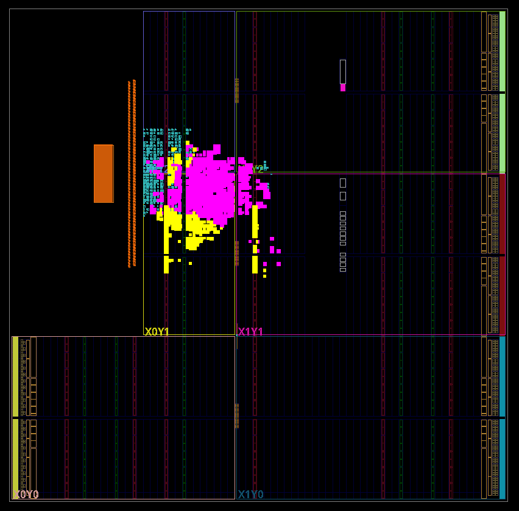
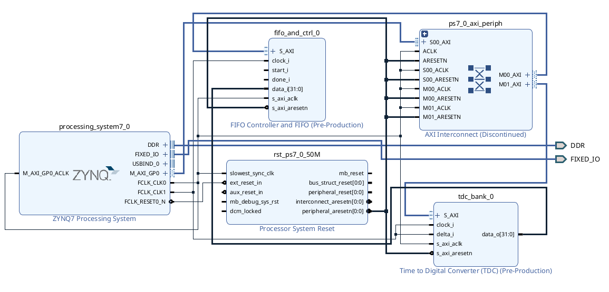

# SnoopyPower (HW) — Vivado Bitstream + PYNQ Overlay

This folder contains the **hardware design** (Vivado project + custom IP sources)
used by SnoopyPower. The userspace measurement code and analysis pipeline live
in `../firmware/` and `../notebooks/` respectively.

The TDC + FIFO IPs in `ip_repo/` are derived from the
[SCAbox](https://emse-sas-lab.github.io/SCAbox/) project (École des
Mines de Saint-Étienne); the upstream component name `emse.sas:sca:tdc_bank`
and `emse.sas:sca:fifo_and_ctrl` is preserved inside `component.xml` so the
Vivado IP catalog still recognises them.

The workflow for this folder is:

1. Open the Vivado project
2. Generate the bitstream
3. Copy the resulting `.bit` + `.hwh` to the PYNQ board
4. Load the overlay directly from the PYNQ operating system (no Vitis required)

---

## Repository layout

- `SnoopyPower.xpr` — Vivado project
- `ip_repo/` — packaged IPs (FIFO + control, TDC bank, etc.)
- `snoopypower.bit` — generated bitstream (tracked for convenience)
- `snoopypower.hwh` — hardware handoff for PYNQ (tracked for convenience)
- `snoopypower.xsa` — optional export artifact (not required for the PYNQ overlay flow)

---

## Requirements

- Xilinx Vivado (version compatible with the project / board)
- A PYNQ-enabled target board (PynqZ1 or Zybo Z7-20 in this design)

---

## Build the bitstream (Vivado)

1. Open the project:
   - Launch Vivado
   - **File → Open Project…** → select `SnoopyPower.xpr`

2. Make sure the packaged IP repository is visible:
   - **Tools → Settings → IP → Repository**
   - Add / verify the path: `ip_repo`

3. Generate the bitstream:
   - **Generate Bitstream**
   - (Optional) open the block design and validate it before generating

After a successful build, export/copy the generated artifacts you need:
- `*.bit` (bitstream)
- `*.hwh` (hardware handoff metadata)

This repo already tracks a pre-built pair:
- `snoopypower.bit`
- `snoopypower.hwh`

---

## Deploy on the board

Copy the files to the board and load the overlay from Python:

```python
from pynq import Overlay

ol = Overlay("snoopypower.bit")   # snoopypower.hwh must be alongside
ol.download()

# Example: access instantiated IP blocks (names depend on your BD)
# fifo = ol.fifo_and_ctrl_0
# tdc  = ol.tdc_bank_0
```

Or via the FPGA manager from the shell:

```bash
sudo cp snoopypower.bit /lib/firmware/
echo snoopypower.bit | sudo tee /sys/class/fpga_manager/fpga0/firmware
```

---

## TDC Design

For this OS version, **no additional constraint files are required**: the TDC
is fixed at a particular location. Below is the floorplan (TDC highlighted
pink and FIFO HW in yellow).

<p align="center">
  
</p>

## Block Design

<p align="center">
  
</p>
